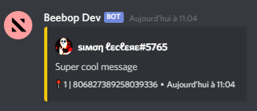
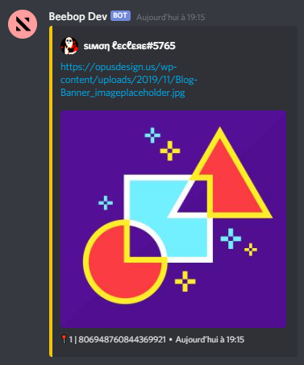

# Advanced usage

Here you can find information to make a more advanced use of the module with explanations and examples.

## Starboard create

The `manager.create()` method takes as second argument an optional object. This object is used to specify the options of the starboard to be created.

### • options.emoji

Type : `String` or `null` <br>
Default value : `'⭐'`

This option allows you to customize the emoji you need to react with to get a message into the starboard. The emoji will then also be changed on the embeds. You can use a custom emoji by using the syntax `<:name:id>` or by specifying only its id.

```js
client.starboardsManager.create(message.channel, {
    emoji: '📍',
});
```



### • options.starBotMsg

Type : `Boolean` or `null` <br>
Default value : `true`

This option enables or disables the ability to add bot messages to the starboard. When disabled, the `starboardNoStarBot` event will be emitted when a user reacts to a message from a bot.

```js
client.starboardsManager.create(message.channel, {
    starBotMsg: false, // Or true
});
```

### • options.selfStar

Type : `Boolean` or `null` <br>
Default value : `true`

This option allows you to define whether or not users can add their own messages to the starboard. When it is disabled, the `starboardNoSelfStar` event will be emitted when a user reacts to his own message.

```js
client.starboardsManager.create(message.channel, {
    selfStar: false, // Or true
});
```

### • options.starEmbed

Type : `Boolean` or `null` <br>
Default value : `true`

This option allows you to define whether or not users can add embeds to the starboard. If this option is enabled, then the embed image or its description will be used as the content of the message. Otherwise, the `starboardNoEmptyMsg` event will be emitted.

```js
client.starboardsManager.create(message.channel, {
    starEmbed: false, // Or true
});
```

### • options.attachments

Type : `Boolean` or `null` <br>
Default value : `true`

This option allows you to define whether or not users can star images. If this option is disabled and a user reacts to a message that contains only an image, then the `starboardNoEmptyMsg` event will be emitted.

```js
client.starboardsManager.create(message.channel, {
    attachments: true, // Or false
});
```

### • options.resolveImageUrl

Type : `Boolean` or `null` <br>
Default value : `true`

This option allows you to set whether urls to images should be resolved to display the image properly in the starboard message.

```js
client.starboardsManager.create(message.channel, {
    resolveImageUrl: true, // Or false
});
```

Without the option enabled :


With the option enabled :



### • options.threshold

Type : `Number` <br>
Default value : `1`

This option allows you to set the number of reactions required for a message to enter the starboard.

```js
client.starboardsManager.create(message.channel, {
    threshold: 3,
});
```

### • options.color

Type : [`colorResolvable`](https://discord.js.org/#/docs/main/stable/typedef/ColorResolvable) <br>
Default value : `'#f1c40f' (yellow)`

This option allows you to customize the color of the embeds of the starboard. You can also use a gradient (see [Use a color gradient for the embed according to the number of stars](#use-a-color-gradient-for-the-embed-according-to-the-number-of-stars).

```js
client.starboardsManager.create(message.channel, {
    color: 'f3522f',
});
```

### • options.allowNsfw

Type : `Boolean` or `null` <br>
Default value : `false`

This option allows you to choose whether or not messages from an NSFW channel can be added to the starboard. It is not recommended to enable this option on community servers or servers with sensitive or minor audience.

```js
client.starboardsManager.create(message.channel, {
    allowNsfw: true, // Or false
});
```

## Edit a starboard

The module has a `manager.edit()` method to edit a Starboard. It takes as argument a channel id, an emoji and an object containing the options to be modified. You can edit all options but not the `channelID` or `guildID` attributes.

Example :
```js
client.starboardsManager.edit(message.channel.id, '⭐', { emoji: '📍' }); // Will change the starboard emoji
```

## Tips and tricks

Here are some tips and lines of code to use the module properly. Feel free to share yours to be added here!

### • Allow only one starboard per server

```js
if(client.starboardsManager.starboards.find(s => s.guildID === message.guild.id)) {
    return message.channel.send('There is already a starboard on this server!');
}
```

### • Using the starboardEdited event

```js
const transform = require('lodash.transform');
const isEqual = require('lodash.isequal');
const isObject = require('lodash.isobject');

function difference(object, base) {
	function changes(obj, base2) {
		return transform(obj, function(result, value, key) {
			if (!isEqual(value, base2[key])) {
				result[key] = (isObject(value) && isObject(base2[key])) ? changes(value, base2[key]) : value;
			}
		});
	}
	return changes(object, base);
}


manager.on('starboardEdited', (old, updated) => {

    const diff = difference(old.options, updated.options);

    const embed = new Discord.MessageEmbed()
        .setTitle('Starboard edited !')
        .setDescription('Here are the modified options')
    
    for(const element in diff) {
        embed.addField(element, diff[element], true);
    }

    const channel = client.channels.cache.get(updated.channelID);
    if(channel) return channel.send(embed);

})
```

### Translating the "Jump to the message" section

To translate "Jump to the message" you can use the `translateClickHere` option in the manager. It can be a string, a function that takes a message as a parameter, or null.

```js
const manager = new StarboardsManager(client, {
    storage: false,
    translateClickHere: 'Cliquez ici pour accéder au message', // 🇫🇷 French !
});
```

Or

```js
const manager = new StarboardsManager(client, {
    storage: false,
    translateClickHere: (msg) => client.translate('starboardClickHere', message.guild.id) // Assuming the client.translate() function exists ;)
});
```

### Use a color gradient for the embed according to the number of stars

The `color` option can be either a string or an object containing an array of colors and a maximum.
This object must be of the form : 

```js
color: {
    colors: ['#ffe26c', '#ffcc00', '#ff7c00', '#ff5500', '#ff0000'],
    max: 10,
}
```

In this example, if the message receives only one reaction, the color of the embed will be `#ffe26c`, if it receives 4 reactions, the color will be `#ff7c00`, and if the message receives 10 or more reactions, then its color will be `#ff0000`.